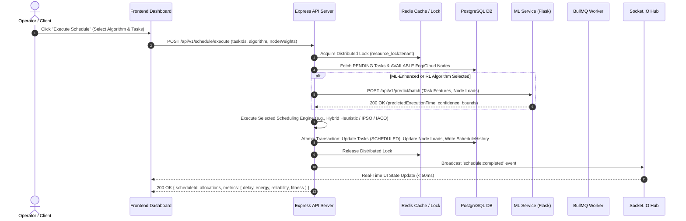
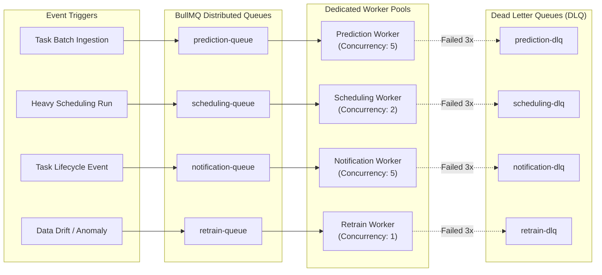
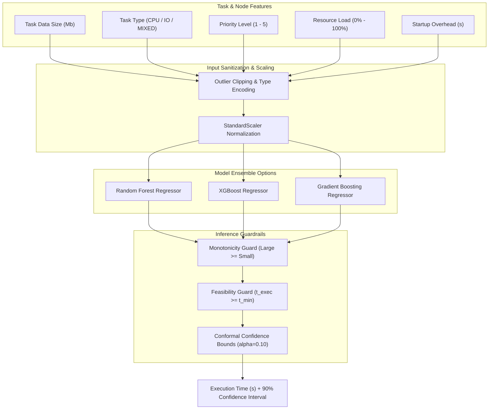

# ⚡ Intelligent Task Allocation and Scheduling System
### *ML-Assisted Fog-Cloud Computing Optimization & Bio-Inspired Metaheuristics*

<p align="center">
  
  
  
  
  
  
  
  
</p>

---

## 📌 Executive Summary

The **Intelligent Task Allocation and Scheduling System** is an enterprise-grade, full-stack distributed platform designed to solve multi-objective, non-deterministic polynomial-time (NP-hard) task scheduling challenges across multi-tiered **Fog-Cloud Computing** architectures.

Bridging the gap between theoretical academic research and high-performance production systems, this project implements and extends the mathematical optimization models established by **Wang & Li (2019)** (*"Task Scheduling Based on a Hybrid Heuristic Algorithm for Smart Production Line with Fog Computing"*, *Sensors*). It integrates **Bio-Inspired Metaheuristic Algorithms** (IPSO, IACO, Hybrid Heuristic), **Deep Reinforcement Learning** (MaskablePPO with Dot-Product Attention Pooling), and **Machine Learning Regressors** (XGBoost, Random Forest, Gradient Boosting) into a reactive, microservices-based operational platform.

> **Academic Affiliation**: BITS Pilani Online | BSc Computer Science | Study Project (`BCS ZC241T`)  
> **Team Byte_hogs**: Shri Srivastava (`2023ebcs593`), Ichha Dwivedi (`2023ebcs125`), Aditi Singh (`2023ebcs498`)  
> **Project Advisor / Supervisor**: Swapnil Saurav  

---

## 📑 Table of Contents

- [Key System Highlights](#-key-system-highlights)
- [System Architecture](#-system-architecture)
  - [High-Level Microservices Topology](#high-level-microservices-topology)
  - [Service Roles & Separation of Concerns](#service-roles--separation-of-concerns)
  - [End-to-End Scheduling Sequence](#end-to-end-scheduling-sequence)
  - [BullMQ Asynchronous Job Pipeline](#bullmq-asynchronous-job-pipeline)
  - [ML Feature Engineering & Inference Guardrails](#ml-feature-engineering--inference-guardrails)
- [Fog Computing Mathematical Model](#-fog-computing-mathematical-model)
  - [1. 3-Layer Network Architecture](#1-3-layer-network-architecture)
  - [2. Time Delay Formulations](#2-time-delay-formulations)
  - [3. Energy Consumption Model](#3-energy-consumption-model)
  - [4. Multi-Objective Fitness Optimization](#4-multi-objective-fitness-optimization)
- [Implemented Scheduling Strategies](#-implemented-scheduling-strategies-10-algorithms)
- [Research Reproduction Suite (Wang & Li 2019)](#-research-reproduction-suite-wang--li-2019)
- [Complete Project Directory Structure](#-complete-project-directory-structure)
- [Quick Start Guide](#-quick-start-guide)
  - [Option A: Docker Compose (Automated & Recommended)](#option-a-docker-compose-automated--recommended)
  - [Option B: Manual Bare-Metal Installation](#option-b-manual-bare-metal-installation)
  - [Default Seeded Credentials](#default-seeded-credentials)
- [Core API Routes & Endpoints](#-core-api-routes--endpoints-19-modules)
- [ML & Deep Reinforcement Learning Pipeline](#-ml--deep-reinforcement-learning-pipeline)
  - [Model Architecture & Validation Metrics](#model-architecture--validation-metrics)
  - [Deep Reinforcement Learning (MaskablePPO)](#deep-reinforcement-learning-maskableppo)
  - [Explainability & Conformal Prediction](#explainability--conformal-prediction)
- [Database Schema (30 Prisma Entities)](#-database-schema-30-prisma-entities)
- [Enterprise Security Architecture](#-enterprise-security-architecture)
- [Observability, Telemetry & Chaos Engineering](#-observability-telemetry--chaos-engineering)
- [Testing & Quality Assurance Audit Suite](#-testing--quality-assurance-audit-suite)
- [Cloud Deployment & Kubernetes Infrastructure](#-cloud-deployment--kubernetes-infrastructure)
- [Team & Academic Credits](#-team--academic-credits)
- [References & Citation](#-references--citation)
- [License](#-license)

---

## 🌟 Key System Highlights

- **10 Industrial & Research Scheduling Algorithms**: Full implementations of Hybrid Heuristic (IPSO + IACO), IPSO, IACO, ML-Enhanced, RL-PPO (MaskablePPO), Min-Min, Earliest Deadline First (EDF), Shortest Job First (SJF), Round-Robin, and First-Come-First-Served (FCFS).
- **Sub-15ms ML Inference**: Predictive regression pipeline evaluating task data size, computation intensity, priority, resource load, and startup overhead with $R^2 = 0.9483$.
- **Deep Reinforcement Learning**: Policy optimization with dynamic dot-product attention pooling trained on 4-tier fog topology environments.
- **Explainable Decisions & Uncertainty Bounds**: SHAP (SHapley Additive exPlanations) feature attributions and Split Conformal Prediction intervals ($\alpha = 0.10, 90\%$ statistical coverage).
- **Live Reactive Dashboard (26 Pages, 24 Components)**: Real-time visual network topologies, drag-and-drop Kanban task orchestration, interactive Gantt timelines, node congestion heatmaps, and customizable experiment wizards.
- **High-Throughput Asynchronous Workers**: BullMQ Redis-backed worker queues managing batch predictions, scheduling transactions, notification fanouts, and background model retraining with Dead Letter Queues (DLQ).
- **Paper Reproduction Benchmarking**: Native reproduction of Wang & Li (2019) Figures 5–8 demonstrating completion time, energy consumption, and reliability across task counts (50–300) and deadline tolerances (10–100s).
- **Zero-Trust Security**: Double-submit CSRF protection, short-lived JWTs with single-use refresh token rotation, bcrypt password hashing, 6 granular rate-limiting tiers, and RBAC (`ADMIN`, `USER`, `VIEWER`).
- **Comprehensive Observability & Chaos Testing**: Prometheus metric scrapers, Grafana operational dashboards, OpenTelemetry distributed tracing, and fault injection (latency, error spikes, pod outages).

---

## 🏗️ System Architecture

### High-Level Microservices Topology

```
┌────────────────────────────────────────────────────────────────────────────────────────┐
│                                   CLIENT LAYER                                         │
│   React 18 SPA (Vite + TypeScript)  │  Socket.IO Real-time Engine  │  Tailwind CSS     │
│   Port: 3000 (Nginx Port 80 in Docker)                                                 │
└───────────────────────────────────────────┬────────────────────────────────────────────┘
                                            │ HTTP / WebSocket
                                            ▼
┌────────────────────────────────────────────────────────────────────────────────────────┐
│                              APPLICATION GATEWAY & API                                 │
│   Node.js 20 LTS + Express API Server (TypeScript)                                     │
│   • 19 Route Modules (70+ REST Endpoints)    • CSRF / Rate Limiters / JWT Auth         │
│   • 10 Scheduling Algorithm Implementations  • OpenTelemetry Instrumentation          │
│   Port: 3001                                                                           │
└───────┬───────────────────┬──────────────────────────────┬─────────────────────┬───────┘
        │                   │                              │                     │
        ▼                   ▼                              ▼                     ▼
┌──────────────┐    ┌──────────────┐              ┌─────────────────┐   ┌────────────────┐
│  PostgreSQL  │    │ Redis 7      │              │   ML Service    │   │  BullMQ Queue  │
│  Version 15  │    │ • Cache      │              │  Python 3.11    │   │  4 Background  │
│  30 Models   │    │ • Locks      │              │  Flask + PyTorch│   │  Worker Pools  │
│  Port: 5432  │    │ • Pub/Sub    │              │  Port: 5001     │   │  (Concurrency) │
└──────────────┘    └──────────────┘              └─────────────────┘   └────────────────┘
        ▲                                                  ▲
        │                                                  │
┌───────┴──────────────────────────────────────────────────┴─────────────────────────────┐
│                           OBSERVABILITY & MONITORING                                   │
│   Prometheus Telemetry Scraper (Port: 9090) ──▶ Grafana Metrics Dashboards (Port: 3002) │
└────────────────────────────────────────────────────────────────────────────────────────┘
```

### Service Roles & Separation of Concerns

| Service | Tech Stack | Port | Primary Responsibilities |
|---------|------------|------|--------------------------|
| **Frontend** | React 18, Vite, TypeScript, Tailwind CSS, Zustand, React Query, Recharts | `3000` | User dashboard, interactive fog topology canvas, experiment execution wizards, Kanban board, chat/email, analytics reporting. |
| **Backend API** | Node.js 20, Express, TypeScript, Prisma ORM, BullMQ, Socket.IO | `3001` | Core REST API, scheduling algorithm execution engine, database transaction boundaries, real-time WebSocket broadcasting, authentication & RBAC. |
| **ML Service** | Python 3.11, Flask, scikit-learn, XGBoost, PyTorch, Stable-Baselines3, SHAP, Optuna | `5001` | Execution duration regression, MaskablePPO RL scheduling, SHAP feature importance extraction, split conformal prediction intervals, automated retraining. |
| **PostgreSQL** | PostgreSQL 15 Alpine | `5432` | Relational storage for 30 Prisma models (tasks, nodes, devices, metrics, models, users, logs, chat, mail). |
| **Redis** | Redis 7 Alpine | `6379` | High-speed cache, distributed mutual exclusion locks (`ioredis`), Socket.IO pub/sub scaling, BullMQ job queue store. |
| **Prometheus** | Prometheus v2.x | `9090` | Timeseries metric collector scraping Node.js (`prom-client`) and Flask endpoints. |
| **Grafana** | Grafana Community | `3002` | Visual operations dashboards for system load, algorithm benchmarks, latency percentiles, and SLO alerts. |

---

### End-to-End Scheduling Sequence



---

### BullMQ Asynchronous Job Pipeline



---

### ML Feature Engineering & Inference Guardrails



---

## 🧮 Fog Computing Mathematical Model

The scheduling system strictly adheres to the mathematical formulations defined in **Wang & Li (2019)** for 3-layer smart production lines.

### 1. 3-Layer Network Architecture
1. **Terminal Device Layer ($TD_k$)**: IoT sensors, smart production equipment with transmission power $P_T$ and idle power $P_{idle}$.
2. **Fog Computing Layer ($F_j$)**: Edge nodes with local compute capacity $C_j$, base latency $L_j$, and bandwidth $B_j$.
3. **Cloud Computing Layer ($CC$)**: Data center with high compute resources $C_{cloud}$ but higher latency $L_{cloud}$.

### 2. Time Delay Formulations

- **Execution Delay ($T_{Eij}$)**:
  Execution time of task $I_i$ (with data size $D_i$ in Megabits and computation intensity $\theta_i$ in cycles/bit) on Fog Node $F_j$ (with compute capability $C_j$ in cycles/sec):
  $$T_{Eij} = \frac{D_i \times 10^6 \times 8 \times \theta_i}{C_j}$$

- **Transmission Delay ($T_{Tij}$)**:
  Network transmission time from terminal device to node $F_j$ with base latency $L_j$ and bandwidth $B_j$:
  $$T_{Tij} = L_j + \frac{D_i}{B_j}$$

- **Total Task Delay ($T_{Dij}$)**:
  Including startup overhead $S_i$:
  $$T_{Dij} = T_{Tij} + T_{Eij} + S_i$$

### 3. Energy Consumption Model

The energy consumed by terminal device $TD_k$ offloading task $I_i$ to fog node $F_j$:
$$E_{ij} = (T_{Tij} \times P_T) + (T_{Eij} \times P_{idle})$$

Where:
- $P_T$: Transmission power (Watts)
- $P_{idle}$: Device idle state power consumption (Watts)

### 4. Multi-Objective Fitness Optimization

For a schedule allocating $N$ tasks to $M$ fog nodes, the system minimizes a composite multi-objective cost function:

$$\text{Objective Value} = \sum_{i=1}^{N} \left( w_{delay} \cdot T_{Dij} + w_{energy} \cdot E_{ij} + 10 \cdot \text{Cost}_{egress} + \text{Penalty}_{hardware} \right)$$

$$\text{Fitness} = \frac{1}{\text{Objective Value} + \epsilon}$$

Where hardware constraint penalties enforce physical memory and VRAM capacity constraints:
$$\text{Penalty}_{hardware} = \begin{cases} 1000 \times \left(\frac{\text{ReqMem}}{\text{NodeMem}} + \frac{\text{ReqVRAM}}{\text{NodeVRAM}}\right) & \text{if capacity exceeded} \\ 0 & \text{otherwise} \end{cases}$$

---

## 🧠 Implemented Scheduling Strategies (10 Algorithms)

| Category | Algorithm | Algorithmic Complexity | Optimization Target | Best Used When |
|:---|:---|:---|:---|:---|
| **Bio-Inspired** | **Hybrid Heuristic (HH)** | $\mathcal{O}(I \cdot (P \cdot N + A \cdot N))$ | Multi-Objective (Time + Energy + Reliability) | Production environments requiring Pareto-optimal tradeoff between makespan and power. |
| **Bio-Inspired** | **IPSO** | $\mathcal{O}(I \cdot P \cdot N \cdot M)$ | Global exploration with adaptive inertia weight | High-dimensional task spaces requiring rapid convergence without premature stagnation. |
| **Bio-Inspired** | **IACO** | $\mathcal{O}(I \cdot A \cdot N \cdot M)$ | Local path refinement with dynamic pheromone bounds | Complex graph dependencies and strict network link capacity optimization. |
| **Machine Learning** | **ML-Enhanced** | $\mathcal{O}(N \cdot M) + \mathcal{O}(ML)$ | Latency + Resource Balance composite score | High-throughput online streams using model-predicted durations for predictive load balancing. |
| **Deep RL** | **RL-PPO (MaskablePPO)**| $\mathcal{O}(N \cdot d_{emb})$ | Multi-node reward optimization | Dynamic fog topologies with non-stationary arrival rates and strict action masks. |
| **Greedy Heuristic**| **Min-Min** | $\mathcal{O}(N^2 \cdot M)$ | Makespan minimization | Heterogeneous tasks where assigning smallest jobs to fastest nodes maximizes throughput. |
| **Priority** | **Earliest Deadline First (EDF)** | $\mathcal{O}(N \log N)$ | Deadline adherence / SLA compliance | Real-time industrial systems with strict deadline tolerance thresholds. |
| **Priority** | **Shortest Job First (SJF)** | $\mathcal{O}(N \log N)$ | Average turnaround time | Workloads with high variance in task computation intensity. |
| **Deterministic** | **Round-Robin (RR)** | $\mathcal{O}(N)$ | Uniform load spread | Homogeneous nodes with uniform task distributions. |
| **Baseline** | **FCFS** | $\mathcal{O}(N)$ | Strict arrival order preservation | Sequential pipeline processing without preemption. |

---

## 📐 Research Reproduction Suite (Wang & Li 2019)

The repository provides an automated reproduction suite validating the experimental results reported in **Wang & Li (2019), Sections 5.2–5.3**.

```bash
# Run all benchmark experiments via npm script (Backend)
npm run experiments:all

# Or execute specific experiment modes:
npm run experiments:energy                # Figure 6: Energy Consumption vs Task Count
npm run experiments:reliability-tasks     # Figure 7: Reliability vs Task Count
npm run experiments:reliability-tolerance # Figure 8: Reliability vs Deadline Tolerance
```

### Benchmark Summary Trends

| Experiment | Tested Independent Variable | Primary Metric | Observed Result vs Paper Baseline |
|:---|:---|:---|:---|
| **Figure 5** | Task Count (50 to 300 tasks) | Completion Time / Delay (s) | **HH** maintains lowest completion time; divergence over RR and FCFS expands as task count scales $> 150$. |
| **Figure 6** | Task Count (50 to 300 tasks) | Energy Consumption (Joules) | **HH** reduces overall power by **18–34%** compared to RR and Min-Min due to idle-time minimization. |
| **Figure 7** | Task Count (50 to 300 tasks) | System Reliability ($R$) | Reliability decreases non-linearly with scale; **HH** preserves highest reliability bounds ($\ge 0.88$). |
| **Figure 8** | Deadline Tolerance (10s to 100s)| Task Success Ratio (%) | Success ratio increases with tolerance; **HH** reaches $\approx 98\%$ success at 60s tolerance. |

---

## 📁 Complete Project Directory Structure

```
PROJECT/
├── .github/                              # CI/CD workflows and issue templates
├── backend/                              # TypeScript Express Backend API (146 files)
│   ├── src/
│   │   ├── __tests__/                    # Jest unit & integration test suites
│   │   │   ├── api.integration.test.ts
│   │   │   ├── auth.middleware.test.ts
│   │   │   ├── fogComputing.service.test.ts
│   │   │   ├── ml.service.test.ts
│   │   │   ├── scheduler.service.test.ts
│   │   │   └── scheduling.pipeline.test.ts
│   │   ├── lib/                          # Prisma client, Redis client, Logger, Swagger, Locks
│   │   ├── middleware/                   # Auth, CSRF, Rate Limiting, Error Handling, Tracing
│   │   ├── queues/                       # BullMQ queue definitions (Prediction, Scheduling, etc.)
│   │   ├── routes/                       # 19 Route Modules (Auth, Fog, Tasks, Experiments, AI, etc.)
│   │   ├── scripts/                      # Experiment runner, benchmark suites, demo seeders
│   │   ├── services/                     # Business logic: fogComputing, scheduler, ML, chaos, mail
│   │   │   ├── fog/                      # Fog math, algorithms (IPSO, IACO, HH, FCFS, Min-Min)
│   │   │   └── scheduler/                # ML-enhanced scheduler, EDF, SJF, Round-Robin
│   │   ├── simulation/                   # Network topology, congestion generators
│   │   ├── utils/                        # Data formatters, math helpers, token utilities
│   │   ├── validators/                   # Zod request validation schemas
│   │   └── workers/                      # 4 BullMQ background job worker processes
│   ├── prisma/
│   │   ├── schema.prisma                 # 30 Database entity schemas
│   │   └── seed.ts                       # Idempotent database seeder
│   ├── Dockerfile                        # Multi-stage production container definition
│   └── package.json
│
├── frontend/                             # React 18 + Vite + TypeScript (77 files)
│   ├── src/
│   │   ├── api/                          # Axios API clients & endpoints
│   │   ├── components/                   # 24 UI components (ExplainableCard, Charts, Wizards)
│   │   │   ├── charts/                   # Recharts performance & algorithm comparisons
│   │   │   ├── scheduler/                # Interactive scheduling execution widgets
│   │   │   ├── shared/                   # Badges, modals, progress bars, brand icons
│   │   │   └── timeline/                 # Interactive Gantt schedule timelines
│   │   ├── contexts/                     # AuthContext, SocketContext, ThemeContext, ToastContext
│   │   ├── hooks/                        # Custom React state & telemetry hooks
│   │   ├── lib/                          # Axios interceptors (CSRF token, JWT auto-refresh)
│   │   ├── pages/                        # 26 Application Pages (Dashboard, Fog, Kanban, Experiments, etc.)
│   │   ├── store/                        # Zustand centralized global state
│   │   ├── test/                         # Vitest test setup and shims
│   │   └── types/                        # TypeScript domain model types
│   ├── Dockerfile                        # Multi-stage Nginx production container
│   ├── package.json
│   └── vite.config.ts
│
├── ml-service/                           # Python 3.11 Flask Microservice (38 files)
│   ├── datasets/                         # Benchmark datasets (Kaggle Cloud Tasks, Synthetic)
│   ├── environments/                     # Gymnasium multi-tier fog scheduling environments
│   ├── evaluation/                       # Statistical significance tests, NDCG, Cohen's d
│   ├── models/                           # Serialized joblib models & PPO checkpoints
│   ├── routes/                           # Flask blueprints (predict, train, admin, datasets, health)
│   ├── app_factory.py                    # Flask application factory with OpenTelemetry
│   ├── app.py                            # Entrypoint
│   ├── model.py                          # TaskPredictor (RF, XGBoost, GB) with guardrails
│   ├── research.py                       # Optuna HPO, SHAP Explainer, Conformal Predictor
│   ├── train_rl.py                       # MaskablePPO Deep RL with Attention Pooling
│   ├── run_experiments.py                # Standalone research experiment runner
│   ├── requirements.txt                  # Python dependency specifications
│   └── Dockerfile                        # Multi-stage Python container
│
├── infra/                                # Cloud-Native Infrastructure & DevOps (108 files)
│   ├── blue-green/                       # Zero-downtime deployment scripts
│   ├── envs/                             # Environment configuration matrices
│   ├── examples/                         # Kubernetes manifests, Helm charts, Terraform AWS, Istio
│   │   ├── k8s/                          # K8s Deployments, Services, Ingress, HPA, PDB
│   │   ├── terraform/                    # AWS EKS, RDS, ElastiCache infrastructure
│   │   ├── istio/                        # VirtualService, DestinationRule, mTLS policies
│   │   ├── argocd/                       # GitOps Application definitions
│   │   └── chaos-mesh/                   # Pod failure & network latency chaos experiments
│   ├── grafana/                          # Dashboards & SLO alert rules
│   ├── helm/                             # Parameterized Helm charts (dev / staging / prod)
│   ├── loadtest/                         # k6 and autocannon performance benchmark scripts
│   ├── nginx/                            # Reverse proxy configurations
│   └── prometheus/                       # Prometheus scrapers & rule definitions
│
├── docs/                                 # 21 In-Depth Technical Documents
│   ├── ARCHITECTURE.md                   # System architecture & sequence specifications
│   ├── DEPLOYMENT.md                     # Production deployment runbooks
│   ├── DEVELOPER_GUIDE.md                # Development workflow and testing guide
│   ├── ML_INTEGRATION_FLOW.md            # Machine learning pipeline flow
│   ├── Phase1_Project_Proposal.md        # Academic Phase 1 specification
│   ├── Phase2_SRS_Document.md            # Software Requirements Specification (43 FRs)
│   ├── Phase3_Implementation_Validation.md # Phase 3 validation & testing report
│   └── USER_GUIDE.md                     # Comprehensive operator manual
│
├── docker-compose.yml                    # Local & Staging multi-container orchestration
├── docker-compose.production.yml         # Hardened production container setup
├── docker-run.ps1                        # PowerShell automation script for Docker
├── final_e2e_audit.py                    # Complete end-to-end QA verification suite
└── execute_full_audit_suite.py           # Deep audit test runner
```

---

## 🚀 Quick Start Guide

### Option A: Docker Compose (Automated & Recommended)

Ensure **Docker Desktop** (Engine 24.x+) and **Docker Compose v2** are installed and running.

#### Windows (PowerShell):
```powershell
# Automated environment setup, build, and container launch
./docker-run.ps1
```

#### Linux / macOS:
```bash
# 1. Clone the repository
git clone https://github.com/shri33/ML-Task-Scheduler.git
cd ML-Task-Scheduler

# 2. Configure environment file
cp .env.example .env

# 3. Launch all containerized services in detached mode
docker compose up -d --build

# 4. Verify container health status
docker compose ps

# 5. Run Prisma database seed
docker exec task-scheduler-backend npx prisma db seed
```

#### 🌐 Operational Service Endpoints:
| Service | Local URL | Description |
|:---|:---|:---|
| **Frontend Application** | [http://localhost:3000](http://localhost:3000) | Main React Management Dashboard |
| **Backend REST API** | [http://localhost:3001/api/health](http://localhost:3001/api/health) | API Gateway Health Check |
| **Interactive Swagger Docs** | [http://localhost:3001/api/docs](http://localhost:3001/api/docs) | OpenAPI 3.0 Interactive Spec |
| **ML Inference Service** | [http://localhost:5001/api/health](http://localhost:5001/api/health) | Flask ML Microservice Health |
| **Prometheus Telemetry** | [http://localhost:9090](http://localhost:9090) | Metric Scraper & Query Console |
| **Grafana Dashboards** | [http://localhost:3002](http://localhost:3002) | Telemetry & Performance Dashboard |

---

### Option B: Manual Bare-Metal Installation

If running services directly on your host machine:

#### Step 1: Start PostgreSQL & Redis
```bash
# PostgreSQL 15
docker run -d --name local-postgres -p 5432:5432 -e POSTGRES_USER=postgres -e POSTGRES_PASSWORD=password -e POSTGRES_DB=task_scheduler postgres:15-alpine

# Redis 7
docker run -d --name local-redis -p 6379:6379 redis:7-alpine
```

#### Step 2: Set Up Backend Service
```bash
cd backend
npm install
npx prisma generate
npx prisma db push
npm run db:seed
npm run dev
# Backend running on http://localhost:3001
```

#### Step 3: Set Up ML Inference Service
```bash
cd ../ml-service
python -m venv .venv

# On Windows:
.venv\Scripts\activate
# On Linux/macOS:
source .venv/bin/activate

pip install -r requirements.txt
python app.py
# ML Service running on http://localhost:5001
```

#### Step 4: Set Up Frontend SPA
```bash
cd ../frontend
npm install
npm run dev
# Frontend running on http://localhost:3000
```

---

### 🔑 Default Seeded Credentials

The database seeder automatically initializes three RBAC user personas:

| User Persona | Email Address | Default Password | Role | Permissions |
|:---|:---|:---|:---|:---|
| **System Administrator** | `admin@example.com` | `password123` | `ADMIN` | Full control: node provisioning, retrain triggering, chaos testing, user management. |
| **Standard Operator** | `demo@example.com` | `password123` | `USER` | Task creation, scheduling execution, experiment runs, analytics export. |
| **Auditor / Viewer** | `viewer@example.com` | `password123` | `VIEWER` | Read-only access to dashboards, metrics, and generated reports. |

---

## 🔌 Core API Routes & Endpoints (19 Modules)

The Express backend exposes 70+ REST endpoints adhering to standard HTTP semantics:

| Module | Route Prefix | Key Endpoints & Capabilities |
|:---|:---|:---|
| **Auth** | `/api/v1/auth` | `POST /login`, `POST /register`, `POST /refresh`, `POST /logout`, `GET /me`, `POST /forgot-password`, `GET /google` |
| **Fog Computing** | `/api/v1/fog` | `GET /nodes`, `POST /nodes`, `POST /schedule`, `POST /compare`, `GET /metrics/export`, `POST /simulate` |
| **Tasks** | `/api/v1/tasks` | `GET /`, `POST /`, `GET /:id`, `PATCH /:id`, `DELETE /:id`, `POST /bulk`, `POST /:id/comments` |
| **Devices (IoT)** | `/api/v1/devices` | `GET /`, `POST /`, `POST /:id/heartbeat`, `GET /:id/metrics`, `GET /:id/logs` |
| **Experiments** | `/api/v1/experiments`| `POST /run` (Figures 5-8 reproduction), `GET /results`, `GET /results/:id`, `GET /summary` |
| **Simulation** | `/api/v1/simulation` | `GET /topology`, `POST /run`, `GET /congestion-map`, `POST /reset` |
| **Scheduling** | `/api/v1/schedule` | `POST /execute`, `GET /algorithms`, `GET /history`, `GET /status/:id` |
| **Reports** | `/api/v1/reports` | `POST /generate/pdf` (Completion, Energy, Reliability reports), `GET /export/csv` |
| **Metrics** | `/api/v1/metrics` | `GET /realtime`, `GET /timeline`, `GET /anomalies`, `GET /prometheus` |
| **ML Engine** | `/api/v1/ml` | `GET /models`, `POST /predict`, `POST /retrain`, `GET /drift-status`, `PUT /config` |
| **AI Assistant** | `/api/v1/ai` | `POST /chat` (NVIDIA NIM Llama 3.1 contextual assistant), `POST /scenario/generate` |
| **Resources** | `/api/v1/resources` | `GET /`, `POST /`, `PATCH /:id/load`, `GET /capacity-matrix` |
| **Chaos Console** | `/api/v1/chaos` | `POST /inject/latency`, `POST /inject/error-spike`, `POST /inject/node-kill`, `POST /reset` |
| **Live Chat** | `/api/v1/chat` | `GET /channels`, `POST /channels`, `GET /messages`, `POST /upload` |
| **Internal Mail** | `/api/v1/mail` | `GET /inbox`, `GET /sent`, `POST /compose`, `PATCH /:id/read` |
| **Calendar** | `/api/v1/calendar` | `GET /events`, `POST /events`, `GET /gantt-schedule` |
| **User Admin** | `/api/v1/user` | `GET /list`, `PATCH /:id/role`, `PUT /preferences`, `GET /audit-logs` |
| **GPU Registry** | `/api/v1/gpu` | `GET /nodes`, `POST /register`, `GET /telemetry` |
| **Health** | `/api/health` | `GET /` (Service status, Redis connectivity, DB latency check) |

---

## 🤖 ML & Deep Reinforcement Learning Pipeline

### Model Architecture & Validation Metrics

The ML service provides sub-15ms execution time estimations based on task complexity and dynamic system load:

| Model | Algorithm Family | Optimal Hyperparameters | Validation $R^2$ | Mean Absolute Error (MAE) |
|:---|:---|:---|:---|:---|
| **Random Forest (Default)** | Bootstrap Aggregation Ensemble | `n_estimators=250, max_depth=12, min_samples_split=4` | **$0.9483$** | $0.214\text{ s}$ |
| **XGBoost Regressor** | Gradient Boosted Decision Trees | `n_estimators=300, learning_rate=0.05, max_depth=6` | **$0.9521$** | $0.198\text{ s}$ |
| **Gradient Boosting** | Sequential Residual Boosting | `n_estimators=200, learning_rate=0.08, max_depth=5` | **$0.9390$** | $0.231\text{ s}$ |

### Deep Reinforcement Learning (MaskablePPO)

- **Environment**: Custom 4-tier Fog Topology environment built on `gymnasium`.
- **State Space**: Normalized matrix of active task sizes, remaining deadlines, and real-time fog node capacities/VRAM.
- **Action Space**: Discrete action per fog node with invalid action masking (preventing assignments to overloaded or offline nodes).
- **Network Architecture**: Dynamic Dot-Product Attention Pooling encoder paired with a 2-layer MLP policy network ($256 \times 256$).
- **Reward Function**:
  $$R_t = -\left( \alpha \cdot \text{Makespan} + \beta \cdot \text{TotalEnergy} + \gamma \cdot \text{SLAViolations} \right)$$

### Explainability & Conformal Prediction

1. **SHAP TreeExplainer**: Evaluates real-time feature contributions (e.g., verifying that data size and node resource load contribute $> 65\%$ of predicted execution variance).
2. **Split Conformal Prediction**: Calculates calibrated non-conformity scores producing exact prediction intervals:
   $$C(X) = \left[ \hat{y}(X) - q_{1-\alpha}, \hat{y}(X) + q_{1-\alpha} \right]$$
   Guaranteeing $\ge 90\%$ statistical coverage at significance level $\alpha = 0.10$.
3. **Optuna Bayesian Optimization**: Automated Tree-structured Parzen Estimator (TPE) tuner optimizing $k$-fold cross-validation scores during background model retraining jobs.

---

## 🗄️ Database Schema (30 Prisma Entities)

The PostgreSQL database is organized into 5 relational domains:

```
┌────────────────────────────────────────────────────────────────────────────────────────┐
│                               DATABASE DOMAIN OVERVIEW                                 │
├──────────────────────┬─────────────────────────────────────────────────────────────────┤
│ Core Scheduling      │ Task, Resource, ScheduleHistory, Prediction, SystemMetrics      │
├──────────────────────┼─────────────────────────────────────────────────────────────────┤
│ Fog & IoT Topology   │ FogNode, FogTaskAssignment, Device, DeviceLog, DeviceMetric     │
├──────────────────────┼─────────────────────────────────────────────────────────────────┤
│ MLOps Pipeline       │ MlModel, TrainingJob, AutoRetrainConfig                         │
├──────────────────────┼─────────────────────────────────────────────────────────────────┤
│ Security & Identity  │ User, RefreshToken, AuditLog, NotificationPreference,           │
│                      │ UserBehaviorProfile                                             │
├──────────────────────┼─────────────────────────────────────────────────────────────────┤
│ Collaboration & Mail │ ChatRoom, ChatMember, ChatMessage, MessageAttachment,           │
│                      │ MailMessage, MailThread, MailThreadParticipant, MailRecipient,  │
│                      │ MailAttachment, TaskComment, TaskAttachment, TaskEvent          │
└──────────────────────┴─────────────────────────────────────────────────────────────────┘
```

### High-Performance Indexing Strategy
- `Task`: Composite index `[userId, status, priority]` for sub-5ms queue fetching; `[userId, dueDate]` for fast EDF dispatching.
- `Resource`: Composite index `[status, currentLoad]` for immediate allocation candidate filtering.
- Soft Deletion: `deletedAt` timestamps across critical entities allowing audit rollback.

---

## 🔒 Enterprise Security Architecture

- **Token Lifecycle**: Short-lived Access Tokens (15 min) paired with single-use Refresh Tokens stored in PostgreSQL and rotated atomically upon every refresh.
- **Double-Submit CSRF Cookies**: Custom CSRF protection issuing cryptographically secure tokens validated across mutating `POST`, `PUT`, `PATCH`, and `DELETE` requests via `X-CSRF-Token` headers.
- **6-Tier Rate Limiting**:
  - Global API Limiter: 300 req / 15 min
  - Auth Operations: 15 req / 15 min
  - Task Creation: 60 req / min
  - Scheduling Trigger: 20 req / min
  - Research Experiments: 10 req / min
  - ML Predictions: 120 req / min
- **Strict Input Validation**: All incoming requests validated against strict Zod runtime schemas stripping unauthorized fields and neutralizing injection vectors.
- **Circuit Breakers**: Graceful fallback handlers protecting the system when external dependencies (e.g., ML microservice or SMTP servers) experience degraded health.

---

## 📊 Observability, Telemetry & Chaos Engineering

- **Prometheus Metrics**: Exports counters, histograms, and gauges for HTTP request durations, scheduling algorithm makespans, cache hit ratios, and active worker job counts.
- **Pre-Configured Grafana Dashboards**:
  1. *Executive Overview*: System throughput, active nodes, task completion ratios.
  2. *Fog Computing Analytics*: Energy consumption (Joules), node load balance heatmaps, network delay percentiles ($p50, p95, p99$).
  3. *ML & Queue Telemetry*: Model prediction latency, inference drift, BullMQ queue depths, DLQ failure rates.
- **Chaos Injection Console**: Native admin UI to simulate real-world failure scenarios:
  - Synthetic network latency injection ($50\text{ms} - 2000\text{ms}$)
  - HTTP 500 fault rate amplification ($0\% - 100\%$)
  - Simulated Fog Node outages and recovery triggers

---

## 🧪 Testing & Quality Assurance Audit Suite

The codebase includes an extensive multi-tier test suite:

### 1. Automated Test Execution
```bash
# Run Backend Jest Test Suites (Unit & Integration)
cd backend && npm test

# Run Frontend Vitest & Component Tests
cd frontend && npm test

# Run Python ML Service Tests
cd ml-service && pytest

# Execute Automated End-to-End QA Audit Suite (100% Verification)
python final_e2e_audit.py
```

### 2. Comprehensive Test Coverage Matrix

| Test Suite | Framework | Target Files | Key Scenarios Verified |
|:---|:---|:---|:---|
| **Backend Service** | Jest + Supertest | `backend/src/__tests__/*` | Auth middleware, JWT rotation, Fog math correctness, IPSO/IACO convergence, BullMQ scheduling pipeline. |
| **Frontend UI** | Vitest + RTL + Playwright | `frontend/src/pages/__tests__/*` | Dashboard rendering, state updates, Kanban drag-and-drop, WebSocket real-time events. |
| **ML Engine** | Pytest | `ml-service/tests/*` | Regression prediction bounds, model hot-swapping, SHAP attribution computation, conformal coverage. |
| **E2E Audit Suite** | Python (`final_e2e_audit.py`) | All microservices | Complete system verification: Auth $\rightarrow$ Tasks $\rightarrow$ Predictions $\rightarrow$ Schedules $\rightarrow$ Reports $\rightarrow$ Chaos. |

---

## ☁️ Cloud Deployment & Kubernetes Infrastructure

The `infra/` directory provides production-ready infrastructure templates:

- **Kubernetes (K8s)**: Complete manifests located in `infra/examples/k8s/` including Deployments, Services, Ingress routes, Horizontal Pod Autoscalers (`HPA`), and Pod Disruption Budgets (`PDB`).
- **Helm Charts**: Fully parameterized Helm chart located in `infra/helm/` supporting `dev`, `staging`, and `production` values overrides.
- **Terraform IaC**: AWS deployment code in `infra/examples/terraform/` provisioning EKS clusters, Amazon RDS PostgreSQL, and ElastiCache Redis.
- **Service Mesh (Istio)**: VirtualServices, DestinationRules, Mutual TLS (`mTLS`), and canary routing configs in `infra/examples/istio/`.
- **Platform Deployments**:
  - **Render**: Pre-configured `render.yaml` blueprint for instant cloud deployment.
  - **Vercel**: `vercel.json` optimized for frontend SPA edge routing.

---

## 👥 Team & Academic Credits

This project was developed as a Final Year Study Project for the **Online Bachelor of Science in Computer Science** program at **Birla Institute of Technology and Science, Pilani (BITS Pilani)**.

### Team Byte_hogs

| Full Name | Student ID | Academic Email | Key Contributions |
|:---|:---|:---|:---|
| **Shri Srivastava** | `2023ebcs593` | `2023ebcs593@wilp.bits-pilani.ac.in` | System Architecture, Full-Stack Development, Scheduling Engine, ML Pipeline, DevOps |
| **Ichha Dwivedi** | `2023ebcs125` | `2023ebcs125@wilp.bits-pilani.ac.in` | Algorithm Implementation (IPSO/IACO), Fog Mathematical Models, Testing & Validation |
| **Aditi Singh** | `2023ebcs498` | `2023ebcs498@wilp.bits-pilani.ac.in` | Frontend UI/UX Engineering, Analytics Visualizations, Research Benchmarking Suite |

**Project Supervisor**: **Swapnil Saurav**, Department of Computer Science, BITS Pilani.

---

## 📚 References & Citation

If you use this codebase or research implementation in your work, please cite the underlying foundational literature:

```bibtex
@article{wang2019task,
  title={Task Scheduling Based on a Hybrid Heuristic Algorithm for Smart Production Line with Fog Computing},
  author={Wang, Jin and Li, Dong},
  journal={Sensors},
  volume={19},
  number={5},
  pages={1023},
  year={2019},
  publisher={MDPI},
  doi={10.3390/s19051023}
}

@misc{bytehogs2026taskschedule,
  title={Intelligent Task Allocation and Scheduling System with ML-Assisted Optimization},
  author={Srivastava, Shri and Dwivedi, Ichha and Singh, Aditi},
  year={2026},
  institution={BITS Pilani},
  note={Study Project BCS ZC241T}
}
```

---

## 📄 License

This project is licensed under the **MIT License** — see the [LICENSE](LICENSE) file for complete details.

<p align="center">
  <b>BITS Pilani Online | BSc Computer Science | Final Year Project 2025–2026</b><br/>
  <i>Built with precision for research-grade distributed fog computing and ML optimization.</i>
</p>
